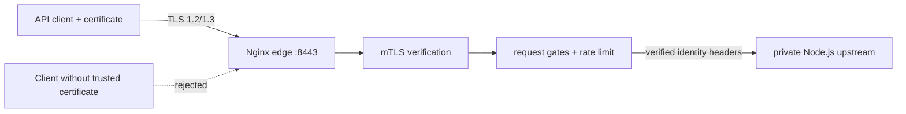

# Nginx mTLS Edge Gateway

A runnable mutual-TLS gateway for machine-to-machine APIs. It demonstrates client-certificate authentication, verified identity propagation, structured audit logs, rate limiting, security headers, a small request denylist, and hardened containers.

> Security boundary: the included pattern denylist is educational and must not be described as a complete WAF. Production certificate issuance, revocation, authorization, and observability are environment-specific.

## Architecture



The upstream has no published host port. Only Nginx can reach it on the Compose network.

## Run locally

Prerequisites: Docker Compose, OpenSSL, curl, and a POSIX-compatible shell.

```bash
chmod +x scripts/*.sh
./scripts/generate-certs.sh
docker compose up -d --wait
./scripts/test-endpoints.sh
docker compose down
```

Manual authorized request:

```bash
curl --cacert certs/ca.crt \
  --cert certs/client.crt \
  --key certs/client.key \
  https://localhost:8443/api/
```

Generated private keys are ignored by Git. Never commit them.

## Security controls demonstrated

| Layer | Control |
| --- | --- |
| Transport | TLS 1.2/1.3 and a server certificate with localhost SANs. |
| Client identity | Required certificate signed by the local demonstration CA. |
| Edge | Per-IP request limiting and explicit rejection signatures. |
| Application | Verified subject and request ID forwarded from the trusted proxy. |
| Runtime | Read-only filesystems, no-new-privileges, and an explicit minimal capability set. |
| Evidence | CI runs authorized and unauthorized integration cases. |

The edge container retains `DAC_READ_SEARCH` only because CI-generated private keys are mode `0600` and owned by the host runner. It allows Nginx's root master process to read the key from a read-only bind mount without granting filesystem write bypass. Production secret delivery should instead align file ownership with the container identity.

## Repository map

| Path | Purpose |
| --- | --- |
| `nginx/` | TLS, identity, logging, proxy, and request-gate configuration. |
| `scripts/generate-certs.sh` | Local CA plus correctly scoped server/client certificates. |
| `scripts/test-endpoints.sh` | Positive and negative integration assertions. |
| `app/server.js` | Minimal private upstream that exposes propagated identity. |
| `docs/production-hardening.md` | Honest boundary between demo and production. |

## Security rationale

The implementation moves machine authentication to the trust boundary, propagates an auditable verified identity, tests rejection paths, and documents the additional certificate-lifecycle and authorization controls required in production.

## License

MIT
